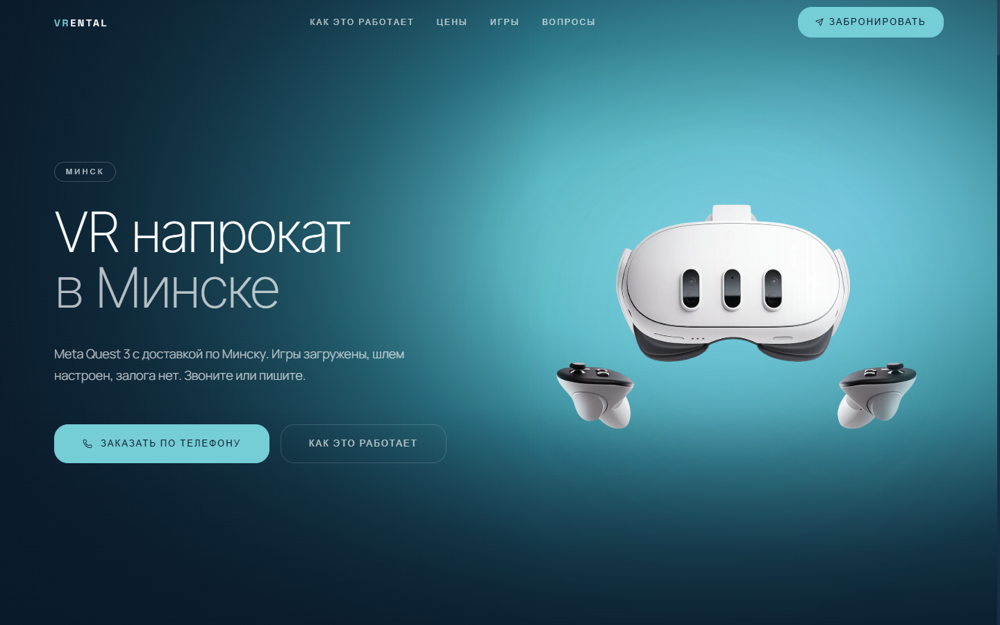

# VRental

[Русский](README.md) · **English**

A rental site for Meta Quest 3 VR headsets and a Telegram bot that takes orders. I first built it for my own rental business, then closed the project and kept the code as a work sample. The name, phone number, city and company details in it are made up.

Demo: https://nikolayyaroslavcev.github.io/vr-rental/



## What the site has

One large landing page: pricing plans, a catalog of 80+ games with an age filter, a "how it works" block, an FAQ and reviews. There are also two service pages, the privacy policy and the rental terms.

The site builds to static files (`output: "export"`), so it can be uploaded to any hosting without Node. It used to live on ordinary shared Apache hosting, which is why there is an `.htaccess` in `public/`.

I also spent some time on SEO: every page has its own canonical and Open Graph tags, the markup includes JSON-LD (LocalBusiness, WebSite, FAQPage), and the sitemap, robots and web manifest are generated through Next file conventions.

Stack: Next.js 16 (App Router), React 19, TypeScript, Tailwind CSS 4, Framer Motion.

## The bot

It lives in `bot/`. It has no dependencies, only `fetch` and Telegram API long polling. The bot asks step by step for the plan, date, address and phone number, validates the input, gives the order a number like `VR-00001`, appends it to `orders.jsonl` and forwards it to the owner.

The buttons on the site are links with pre-filled text, for example "I want to book the 'Week' plan". The bot picks the plan out of such a message and goes straight to choosing the date.

## Running

```bash
npm install
npm run dev
```

The static build goes to `out/`:

```bash
npm run build
```

To build the site for a subfolder, as on GitHub Pages, set these variables:

```bash
NEXT_PUBLIC_BASE_PATH=/vr-rental NEXT_PUBLIC_SITE_URL=https://example.github.io/vr-rental npm run build
```

The bot:

```bash
cd bot
echo "BOT_TOKEN=токен от @BotFather" > .env
echo "OWNER_ID=ваш chat id" >> .env
node index.js
```

There is a pm2 config for automatic restarts: `pm2 start ecosystem.config.cjs`.
